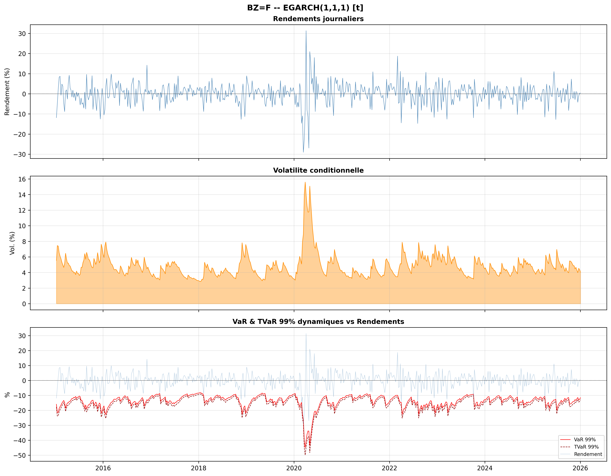

# tickerlab

> Plateforme Python d'économétrie financière : modélisation de la volatilité conditionnelle, mesure du risque de marché et backtesting réglementaire.




---

## Contexte

La mesure du risque de marché se heurte à deux difficultés communes à la plupart des classes d'actifs : une volatilité conditionnelle fortement asymétrique, où les chocs négatifs pèsent davantage que les chocs positifs de même ampleur, et des ruptures structurelles qui invalident l'hypothèse de stabilité des paramètres.

tickerlab industrialise la chaîne complète : estimation, mesure de risque, validation pour tout actif disposant d'un historique de prix : actions, indices, devises, matières premières. L'objectif n'est pas de produire une VaR, mais de produire une VaR dont on sait si elle tient.

## Fonctionnalités

**Modélisation de la moyenne**
Estimation ARIMA sur log-rendements, sélection automatique de l'ordre, diagnostics de résidus.

**Volatilité conditionnelle**
Spécifications GARCH, EGARCH, TGARCH et Component GARCH. Lois normale, Student, Student asymétrique et GED. Sélection par critère AIC avec fenêtre ΔAIC, complétée d'un score composite intégrant les diagnostics de résidus et un terme de parcimonie.

**Ruptures structurelles**
Détection par ICSS et test de Zivot-Andrews, intégrée à l'équation de variance.

**Mesure de risque**
VaR et Expected Shortfall par simulation historique filtrée et bootstrap, avec correction de Cornish-Fisher et garde de monotonicité.

**Backtesting réglementaire**
Six tests de niveau FRTB : couverture inconditionnelle (Kupiec), indépendance des exceptions (Christoffersen), Dynamic Quantile (Engle-Manganelli), adéquation de l'Expected Shortfall (Acerbi-Székely, Fissler-Ziegel), et test PIT de Berkowitz.

**Comparaison prédictive**
Test de Diebold-Mariano sur fonction de perte tick, avec correction de Giacomini-Komunjer.

**Reporting**
Génération automatisée de rapports PDF, avec sorties reproduisant le format EViews afin d'assurer la traçabilité et la vérifiabilité des estimations.

## Installation

```bash
git clone https://github.com/t4rlk/tickerlab.git
cd tickerlab
```

**Linux / macOS**

```bash
python -m venv .venv
source .venv/bin/activate
```

**Windows (PowerShell)**

```powershell
python -m venv .venv
.venv\Scripts\Activate.ps1
```

Puis, quel que soit le système :

```bash
pip install -e .           # pipeline seul
pip install -e ".[web]"    # + interface web (FastAPI)
pip install -e ".[ai]"     # + rédaction assistée des commentaires
pip install -e ".[dev]"    # + outils de test
```

Configuration optionnelle pour la rédaction assistée : copier le fichier d'exemple, puis renseigner la clé du fournisseur choisi :

```bash
cp .env.example .env       # Linux / macOS
copy .env.example .env     # Windows
```

La rédaction assistée nécessite un dossier `prompts/` contenant un fichier `.txt` par section. Ces gabarits ne sont pas fournis dans le dépôt public.

## Utilisation

**En ligne de commande**

```bash
tickerlab run BZ=F --from 2006-01-01 --to 2024-12-31       # Brent
tickerlab run ^GSPC --from 2010-01-01 --to 2024-12-31      # S&P 500
tickerlab run EURUSD=X --from 2015-01-01 --to 2024-12-31   # EUR/USD
```

Le rapport PDF est généré dans `resultats/`.

**Interface web**

```bash
tickerlab-web
```

Configurateur accessible sur `http://localhost:8742` : paramétrage de l'analyse, exécution, et rapport PDF téléchargeable.

## Architecture

```
tickerlab/
├── core/                  # estimation, mesure de risque, backtests
│   └── rapport/           # génération PDF, sections et thèmes
├── utils/                 # rédaction assistée, cache, export LaTeX
├── templates/latex_doc/   # gabarits LaTeX des sections de rapport
├── web/                   # interface FastAPI et frontend statique
├── scripts/               # validation multi-tickers, contrôle de couverture
├── tests/                 # suite de tests
├── docs/                  # documentation et figures
├── main.py                # point d'entrée CLI
└── config.yaml            # paramètres d'exécution
```

## Tests

```bash
pytest
```

231 tests couvrant l'estimation, les mesures de risque, les backtests et la chaîne de génération de rapport. Intégration continue via GitHub Actions, avec seuils de couverture calibrés par module.

## Limites

Les tests de backtesting perdent en puissance sur de courts échantillons : les résultats de couverture conditionnelle demandent une fenêtre suffisante pour être concluants. Les mesures de risque reposent sur l'hypothèse que la loi conditionnelle estimée reste valide hors échantillon, hypothèse d'autant plus fragile que les ruptures structurelles sont fréquentes. Enfin, l'horizon de prévision est d'un jour ; l'extension par racine du temps n'est pas justifiée sous volatilité conditionnelle.

## Références méthodologiques

Bollerslev (1986) · Nelson (1991) · Glosten, Jagannathan & Runkle (1993) · Inclán & Tiao (1994) · Zivot & Andrews (1992) · Kupiec (1995) · Christoffersen (1998) · Berkowitz (2001) · Engle & Manganelli (2004) · Acerbi & Székely (2014) · Fissler & Ziegel (2016) · Diebold & Mariano (1995) · Giacomini & Komunjer (2005)

## Auteurs

**Tarik Yazanel** — conception et développement de la plateforme

## Licence

MIT
